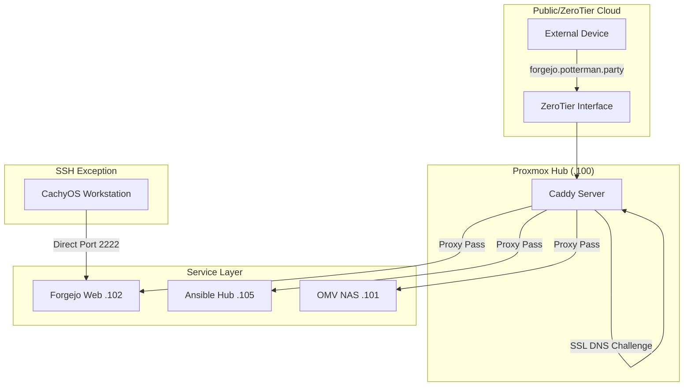

```mermaid
graph TD
    subgraph "Public/ZeroTier Cloud"
        A[External Device] -- "forgejo.potterman.party" --> ZT_IP[ZeroTier Interface]
    end

    subgraph "Proxmox Hub (.100)"
        direction TB
        ZT_IP --> Caddy[Caddy Server]
        Caddy -- "SSL DNS Challenge" --> Caddy
    end

    subgraph "Service Layer"
        direction TB
        Caddy -- "Proxy Pass" --> Forgejo[Forgejo Web .102]
        Caddy -- "Proxy Pass" --> AnsibleHub[Ansible Hub .105]
        Caddy -- "Proxy Pass" --> OMV[OMV NAS .101]
    end

    subgraph "SSH Exception"
        Workstation[CachyOS Workstation] -- "Direct Port 2222" --> Forgejo
    end
```